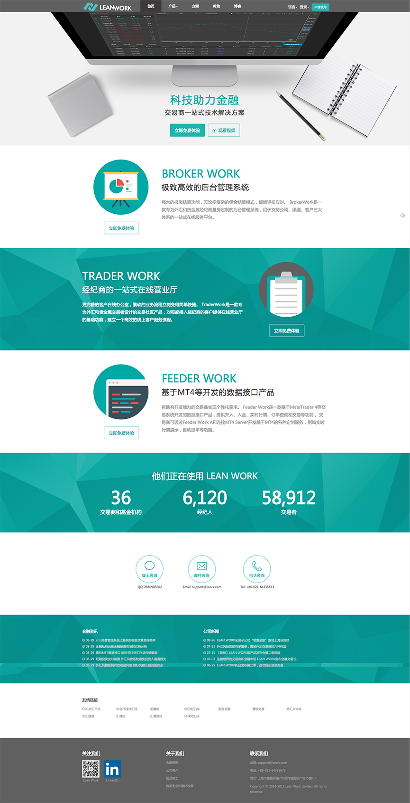
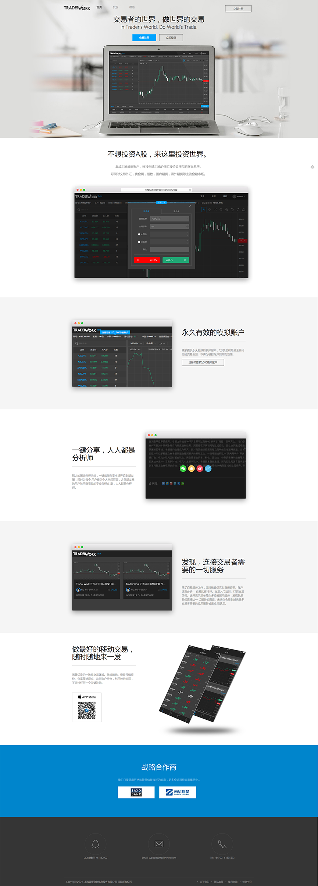
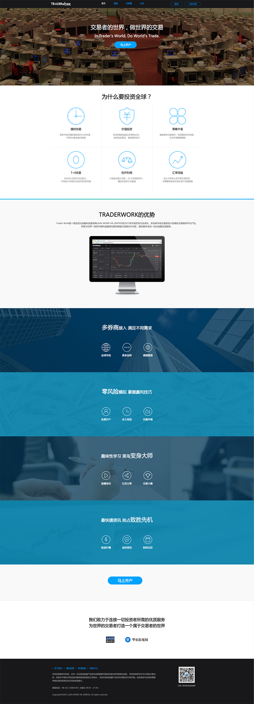
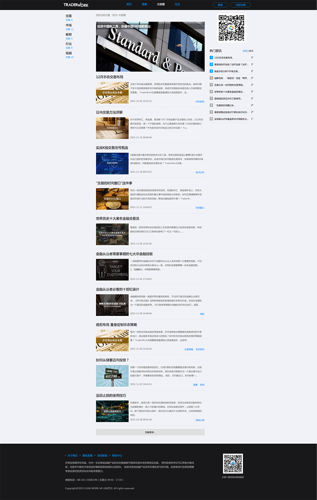
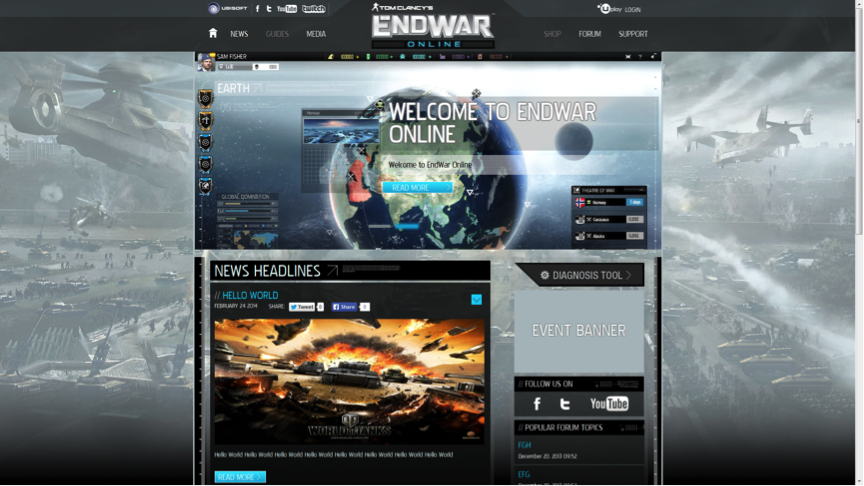
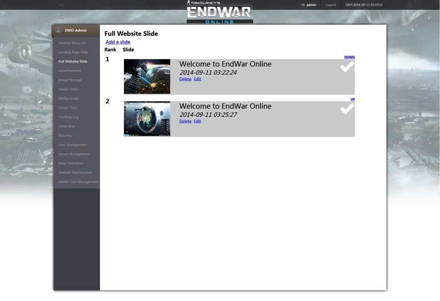
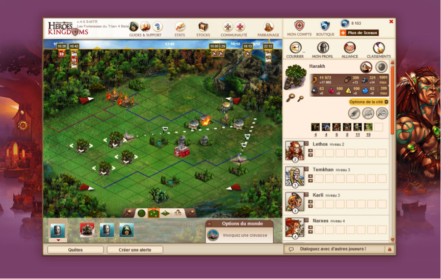
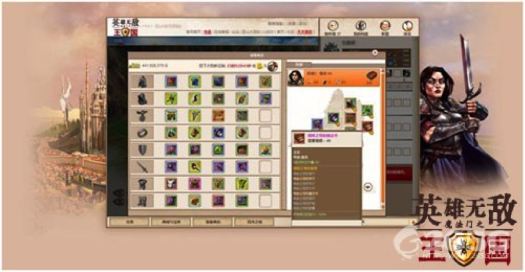

### LEAN WORK HK LIMITED Official Website 2015.05
### Trader Work Official Website 2015.10

[LEAN WORK HK LIMITED](http://www.lwork.com/), a world-leading financial technology service provider.
[Trader Work](http://www.traderwork.com/), an advanced trading tool which is majoring in forex market, under developing by LEAN WORK.

Both websites are based on the most popular blog framework - WordPress. As a front-end engineer, I adopted HTML5, CSS3 with LESS precompile and a bit of JavaScript to fulfill the designs from UI designer. Naturally, to satisfy vast users of mobile devices, I have made the two website to adapt to mobile browsers by implementation of responsive design.

*	LEAN WORK Home Page Screenshot

*	Previous Trader Work Home Page Screenshot

*	Current Trader Work Home Page Screenshot

*	Trader Work Financial News Screenshot

---

### Hasbro Game Channel 2014.05 - 2014.09

Ubisoft Entertainment was cooperating with Hasbro Company to work out a game platform [Hasbro Game Channel][] on XBOX ONE and PS4, which involves the classic board games, such as Monopoly, Risk, Scrabble etc.

My job was working with UI designer to develop the features on client side by web technology, like HTML5, CSS3, AngularJS, RequireJS and jQuery. This product has been released in September 2014. We ensured the platform was released on time even the design had changed several times. I have completed a couple of essential features in this project, such as achievements, friends etc.

[Hasbro Game Channel]: http://hasbrogamechannel.ubi.com/en-US/index.aspx "Hasbro Game Channel Official Website"

*	Home page screenshot

*	My task – Trophy Collection

*	My task – Friends

---

### EndWar Online Official Website 2013.07 - 2014.04

[End War Online][] is a web military strategy game which is developed by UBISOFT. The official website adopted PHP, MySQL and Linux, Apache as the backend side, and Smarty, CSS, jQuery assembled the front-end client.

I played a key role in this project. My responsibilities included developing the features on the website which were surrounding the game (user register, content management system, beta key generation, forum integration, support system integration etc), doing cooperation with the operation team to maintain the web servers. The operation team was satisfied with my work, this website successfully attracted over 60,000 players to register and participate in the technical beta test before I left this project.

[End War Online]: http://ewo.ubi.com

*	Home page screenshot

*	Backend tools for the website

**NOTE:** Current version might be different with the version which I made before, but the structure and functions are supposed to be the same.

---

### Might and Magic: Heroes Kingdom 2010.04 - 2011.11

A strategy game which ran on the web page, it was established by the UBISOFT Paris studio. UBISOFT Chengdu took charge of the Asian version's (China, Hongkong, Korea) development and maintenance.

It was based on pure JavaScript (mootools), CSS, HTML technologies, the backend side utilized PHP, MySQL and Linux plus Apache.
As this game is out of service now, it is unable to play this game anymore, yet there is still an [introduction][mmhk intro] for [MMHK][].

I worked under the guide of experienced programmers, focused on the bug fixing at the beginning, then implemented relatively complicated features, such as weapon shop etc.
This was my first project after my graduation from the university, naturally, I began my job from fixing the bugs. When I was similar with the development process, the more complex tasks were given to me. During this project, I have gained much experience about the web product development. This game had operated in three different regions well.

[mmhk intro]: http://en.wikipedia.org/wiki/Might_and_Magic:_Heroes_Kingdoms
[MMHK]: http://mightandmagicheroeskingdoms.ubi.com/en.html

*	Main page screenshot

*	One of my works - Artifact Shop

---

&copy; 2015 sschengyf.github.io
